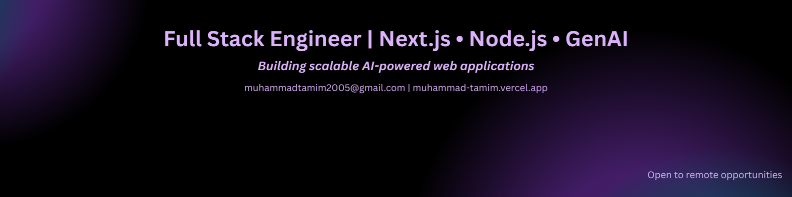

### About Me: 
Hi, I am Muhammad Tamim. I am a Full Stack Engineer building scalable AI-powered web applications using Next.js and Node.js.

I work across the stack by designing REST APIs, implementing secure authentication, and working with PostgreSQL and MongoDB using Prisma. I also deploy and manage applications with Docker, Nginx, and AWS.

Alongside core web development, I build AI-driven features using LangChain and RAG to bring intelligent functionality into applications.

Currently, I am open to remote opportunities to build scalable, AI-powered web applications.

### Skills: 
- **Frontend:** Next.js, React.js, TypeScript, JavaScript, Shadcn, Tailwind CSS, CSS, HTML
- **Backend:** Node.js, Express.js, MongoDB, SQL, PostgreSQL, Zod, Prisma, Nginx, Docker, AWS, Firebase/better/Next/JWT auth, RESTful APIs
- **Gen-AI:** LangChain, RAG

### Github Statistics: 

### Contact with Me:

- [Portfolio: https://muhammad-tamim.vercel.app](https://muhammad-tamim.vercel.app)  
- [Email: muhammadtamim2005@gmail.com](mailto:muhammadtamim2005@gmail.com)  
- [LinkedIn: https://www.linkedin.com/in/tamim-muhammad](https://www.linkedin.com/in/muhammad-tamim)

<!--
**muhammad-tamim/muhammad-tamim** is a ✨ _special_ ✨ repository because its `README.md` (this file) appears on your GitHub profile.

Here are some ideas to get you started:

- 🔭 I’m currently working on ...
- 🌱 I’m currently learning ...
- 👯 I’m looking to collaborate on ...
- 🤔 I’m looking for help with ...
- 💬 Ask me about ...
- 📫 How to reach me: ...
- 😄 Pronouns: ...
- ⚡ Fun fact: ...
-->
