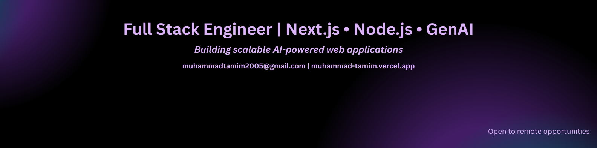

  

## Hi, I am Muhammad Tamim
A Full Stack Engineer building scalable AI-powered web applications using **Next.js**, **Node.js** and **GenAI**.

I design REST APIs, implement secure authentication, and work with **PostgreSQL** and **MongoDB** using **Prisma** and **Mongoose**. I also deploy and manage applications with **Docker** and **Nginx**, and implement testing using **Jest** and **React Testing Library**.

Alongside core web development, I build AI-driven features using **LangChain** and **RAG** to bring intelligent functionality into applications.

## Core Stack: 

### Frontend

  
  

### Backend & Databases

  
  
  
  
  
  

### DevOps

  
  

### Testing

  
  

### Authentication

  
  
  
  

### GenAI

  
  

## Contact with Me:

- Portfolio: https://muhammad-tamim.vercel.app  
- LinkedIn: https://www.linkedin.com/in/muhammad-tamim  
- Email: muhammadtamim2005@gmail.com  

--- 

Currently, I am open to remote opportunities to build scalable, AI-powered web applications.
